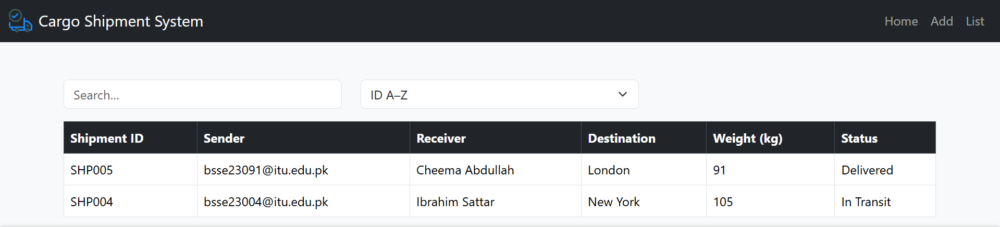

CargoShipmentApp — Feature Summary

1. Mock Login (login.html) — stores credentials in LocalStorage.
2. Dashboard (index.html) — shows total/delivered/in-transit & Chart.js pie chart.
3. Add/Edit Shipment (add.html) — form with HTML5 validation, live feedback, datalist autocomplete.
4. Shipments List (list.html) — dynamic table: add/edit/delete, live search, sort.
5. Role-based view — admin-only “Actions” column.
6. Persistent storage — full CRUD in LocalStorage; data persists across reloads.
7. DOM & Events — form handling, keyboard shortcut (Ctrl+S), confirmation prompts.
8. Responsive design — Bootstrap grid; works on mobile & desktop.

